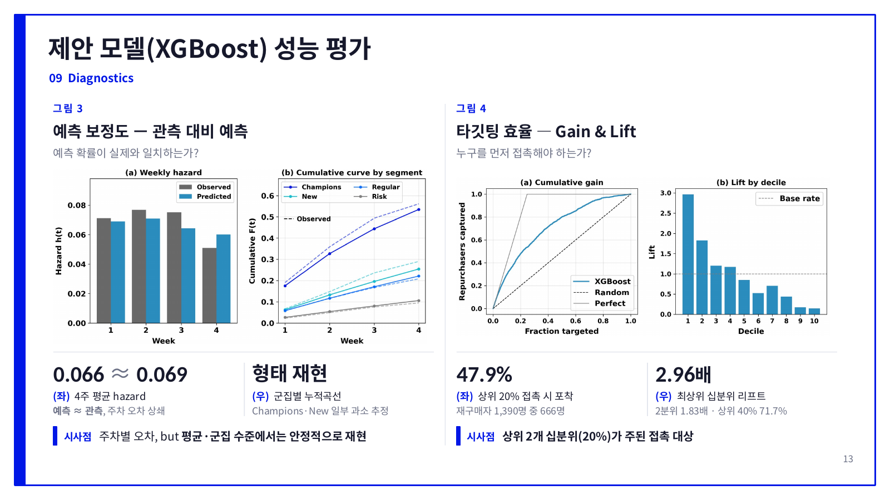
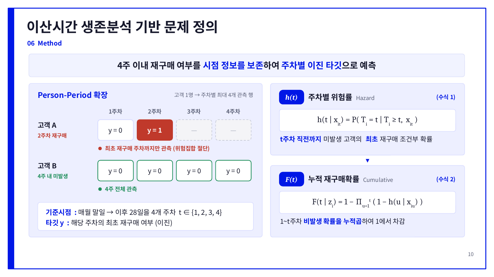
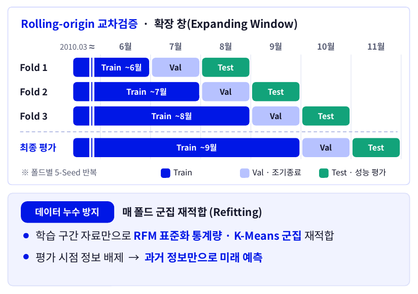

# RFM–코호트 기반 이산시간 생존모형을 활용한 재구매 예측과 CRM 활용 전략

Author : Ye seok Kim, Hyeong Oh Son, Gyu Sun Yong, So Hyun Cho, Young Gyun Kim

온라인 리테일 거래 데이터로 **고객별 4주 내 재구매 확률을 주차 단위로 예측**하고,
예측 확률을 세그먼트·코호트와 결합해 **CRM 대상 선정**까지 연결한 프로젝트입니다.

<!-- TODO: 링크·학회 표기·역할 확인 -->
- [논문](docs/paper.pdf)
- [발표 자료](docs/slides.pdf)
- [상세 결과](docs/results.md)(전체 모델 비교표, 가설 검정 부트스트랩 유의성 표)

한국정보처리학회 ACK 2026 · 제1저자 (전처리, 피처 설계, 모델링·검증, CRM 분석)

`Python` `pandas` `scikit-learn` `XGBoost` `LightGBM` `CatBoost`

## 핵심 결과

- **순위 변별력**: 최종 평가(고객 5,619명)에서 cu_AUC 0.785, cu_PR 0.599로 무작위 기저(0.247)의 2.4배
- **확률 정확도**: 예측 평균 0.243, 실제 0.247. 재구매율이 평소보다 37% 높아진 성수기 구간에서도 유지
- **타깃팅 효율**: 예측 상위 20% 고객만 접촉해도 실제 재구매자의 47.9% 포착 (최상위 십분위 리프트 2.96배)
- **활용**: 세그먼트별 조건으로 CRM 대상 1,947명(전체의 34.7%) 선정



## 접근 방법

1. **전처리**: 1,067,371건에서 중복·비상품·단가 0 이하 거래를 제거해 1,021,254건으로 정리했습니다. 단가 이상치는 상품 중앙값으로 대체하고, 취소·반품은 삭제하지 않고 순매출에 반영했습니다.
2. **세그먼트**: RFM을 로그 변환·표준화한 뒤 K-Means(k=4)로 Champions, Regular, New, Risk를 구분했습니다.
3. **문제 정의**: 월말 기준시점 이후 28일을 4개 주차로 나누고, 고객을 주차별 행으로 펼쳐 주차별 재구매 위험률과 누적 확률을 추정했습니다.
4. **모델**: 기저 모형 3종(주차 평균, 세그먼트×주차, 로지스틱 회귀)과 부스팅 3종(LightGBM, CatBoost, XGBoost)을 비교했습니다.
5. **검증**: 기준시점을 옮겨 가며 평가하는 rolling-origin 교차검증(3 폴드 × 5 시드) 후, 2011-10 말 기준시점에서 11월 1~28일을 예측하는 최종 평가를 했습니다.

**문제 정의**: 재구매한 고객은 최초 재구매 주차까지만, 재구매하지 않은 고객은 4주 전체를 관측합니다.



**검증 설계**: 막대의 월은 예측 구간 기준입니다. Val은 부스팅 모델의 조기 종료에만 사용했습니다.



## 결과

최종 평가 (4주 누적, 실제 재구매율 0.247)

| 모델 | AUC | PR-AUC | Brier | 예측 평균 |
|---|---|---|---|---|
| B0 주차 평균 | 0.500 | 0.247 | 0.188 | 0.202 |
| B1 세그먼트×주차 | 0.726 | 0.431 | 0.161 | 0.219 |
| B2 로지스틱 회귀 | 0.776 | 0.586 | 0.147 | 0.267 |
| **XGBoost** | **0.785** | **0.599** | **0.144** | **0.243** |

- 교차검증 평균 cu_AUC는 0.802였습니다. 부스팅 모델 간 순위 지표 차이는 유의하지 않았고, 확률 오차가 가장 낮은 XGBoost를 선택했습니다.
- 최종 평가에서 XGBoost는 기저 모형 대비 AUC·PR·Brier 모두 유의하게 우수했습니다(페어드 부트스트랩 2,000회, Holm 보정, p<0.01).
- 계절성 변수(pred_month)를 빼면 AUC는 그대로지만 예측 평균이 0.184로 떨어졌습니다. 이 변수가 성수기의 확률 수준을 맞추는 역할을 합니다.

## CRM 활용 예시

| 세그먼트 | 선정 기준 | 대상 수 | 예측 / 실제 재구매율 | 전략 |
|---|---|---|---|---|
| Champions | 예측 전체 상위 40%, 주문당 수량 중앙값 이하, 첫 구매 2010-11까지 | 289 | 0.536 / 0.567 | 업셀링 |
| Regular | 예측 군집 내 하위 50%, 첫 구매 2010-11까지 | 729 | 0.138 / 0.132 | 할인 쿠폰 |
| New | 예측 전체 상위 40%, 첫 구매 2011-08 이후 | 249 | 0.313 / 0.357 | 웰컴 혜택 |
| Risk | 예측 군집 내 상위 30% 또는 첫 구매 2010-11 | 680 | 0.164 / 0.162 | 블랙프라이데이 리마인딩 |

## 분석에서 신경 쓴 점

- **누수 방지**: 기준시점까지의 정보만 사용하고, 폴드마다 학습 구간 자료로 세그먼트를 다시 적합했습니다.
- **확률 수준 유지**: 확률 자체가 산출물이므로 클래스 불균형 보정(가중치·오버샘플링)을 쓰지 않았습니다.
- **평가 단위 구분**: 주차 지표는 재구매 이후 주차를 제외한 자료로, 누적 지표는 전체 4주 자료로 평가하고, 부트스트랩은 고객 단위로 재표집했습니다.

## 한계

- 최종 평가는 2011-10 한 시점이며, 11월 계절성의 학습 근거는 1년치뿐입니다.
- 주차별 위험률은 1~3주차를 과소, 4주차를 과대 추정해 개별 고객의 주차 시점 예측에는 한계가 있습니다.

## 구조와 실행

```
notebooks/
  01_preprocessing.ipynb        # 정제, 단가 이상치 보정
  02_rfm_panel_features.ipynb   # RFM 군집화, 월 패널, 주차별 학습 데이터
  03_hazard_modeling.ipynb      # 모델 비교, 교차검증, 유의성 검정, CRM
docs/                           # 논문, 발표 자료, 상세 결과, 이미지
```

```bash
pip install -r requirements.txt
# UCI에서 online_retail_II.xlsx 를 내려받아 프로젝트 루트에 두고 01 → 02 → 03 순서로 실행
```

데이터: Chen, D. (2012). Online Retail II. UCI Machine Learning Repository. https://doi.org/10.24432/C5CG6D
